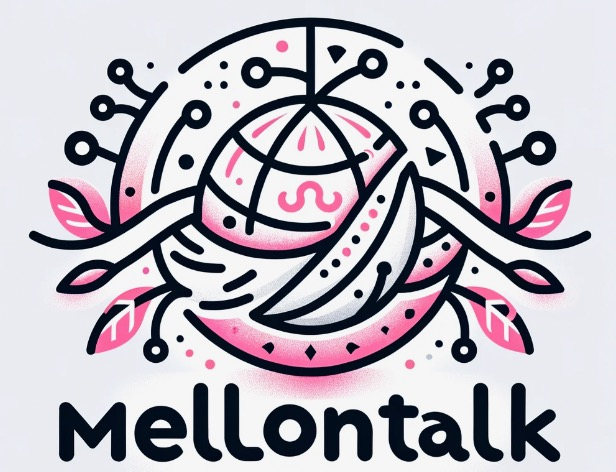

# MellonTalk by AteHate (Made by Chris, Andy, and Lucia) 

<!-- PROJECT LOGO -->
<br />
<div align="center">
  <a href="#">
    
  </a>

  <h3 align="center">Secure-online Voting System Using Homomorphic Encryption
</h3>

  <p align="center">
    We want to help provide a safe space for people to really enjoy gaming as a hobby and not worry about hateful speech and biases.
  </p>
</div>


## Getting Started

To execute the project, follow these instructions:

### Installation


1. Clone the repo
   ```sh
   git clone https://github.com/csong2023/MellonTalk.git
   ```
2. Install Python modules
   ```sh
   python3 -m pip install SpeechRecognition
   brew install portaudio
   pip install pyaudio
   ```
3. Run the code!
   ```sh
   Command + B / Ctrl + B
   ```
<p align="right">(<a href="#readme-top">back to top</a>)</p>